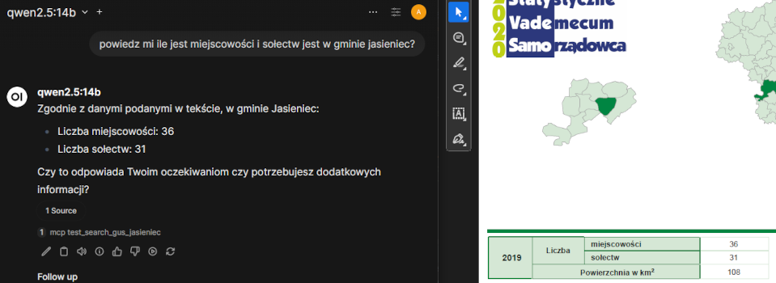

## Serwer MCP

### Co to jest MCP?

Serwer MCP (Model Context Protocol) służy do zapewnienia modelowi kontekstu do działania, czyli narzędzia (Tools) oraz wiedzy.

Serwer MCP można podpiąć do chatów, co poprawia ich działanie.

Na obrazku widać panel do komunikacji z modelem LLM, w którym model skorzystał z serwera MCP i znajdującego się na nim vectorStore,
do którego uprzednio załadowano pdf.


### Uruchomienie projektu mcp-test

Aby uruchomić projekt potrzeba:
- uruchomić serwer ollama i pobrać modele LLM, np. mxbai-embed-large - ten jest potrzebny do odczytania plików pdf.
```bash
ollama pull mxbai-embed-large
```
- skonfigurować application.properties projektu mcp-test
```properties
# potrzebne do EmbeddingModel (odczytywanie pdf) - tutaj należy wpisać adres ollamy
spring.ai.ollama.base-url=http://10.0.0.22:11434
```

- zbudować projekt mcp-test
```bash
mvn clean install
```
Po zbudowaniu, w katalogu target powinien się znajować plik .jar. 

- uruchomienie może odbyć się za pomocą docker compose i na tą okoliczność zostały przygotowane
przykładowe pliki w katalogu config projektu.
Plik .jar należy umieścić w katalogu mcp-test obok Dockerfile.
Uruchomienie odbywa się standardowo za pomocą poniższej komendy:
```bash
docker compose up -d
```

Podczas uruchamiania, w logach powinny pojawić takie lub podobne informacje:
```logs
Rozpoczynam ingest PDF gus_jasieniec.pdf
Registered tools: 4
Started McpDemoApplication in 18.891 seconds (process running for 19.218)
```

### Weryfikacja działania

Aby zweryfikować działanie MCP, można wykonać poniższe zapytania:

#### POST <adres>:<port>/mcp

Body:
```json
{
  "jsonrpc": "2.0",
  "id": 1,
  "method": "initialize",
  "params": {
    "protocolVersion": "2025-03-26",
    "capabilities": {
      "roots": {
        "listChanged": true
      },
      "sampling": {}
    },
    "clientInfo": {
      "name": "ExampleClient",
      "version": "1.0.0"
    }
  }
}
```

Powinien zwrócić coś w stylu:
```json
{
    "jsonrpc": "2.0",
    "id": 1,
    "result": {
        "protocolVersion": "2025-03-26",
        "capabilities": {
            "completions": {},
            "prompts": {
                "listChanged": false
            },
            "resources": {
                "subscribe": false,
                "listChanged": false
            },
            "tools": {
                "listChanged": false
            }
        },
        "serverInfo": {
            "name": "mcp-server",
            "version": "1.0.0"
        }
    }
}
```

#### POST <adres>:<port>/mcp

```json
{
  "jsonrpc": "2.0",
  "id": 2,
  "method": "tools/list"
}
```

Powinien zwrócić coś w stylu:

```json
{
    "jsonrpc": "2.0",
    "id": 2,
    "result": {
        "tools": [
            {
                "name": "employeeLeaveStatus",
                "description": "Sprawdza status urlopu pracownika",
                "inputSchema": {
                    "type": "object",
                    "properties": {
                        "name": {
                            "type": "string"
                        },
                        "employees": {
                            "type": "array",
                            "items": {
                                "type": "object",
                                "properties": {
                                    "name": {
                                        "type": "string"
                                    },
                                    "usedLeaveDays": {
                                        "type": "integer",
                                        "format": "int32"
                                    },
                                    "yearsOfService": {
                                        "type": "integer",
                                        "format": "int32"
                                    }
                                },
                                "required": [
                                    "name",
                                    "usedLeaveDays",
                                    "yearsOfService"
                                ]
                            }
                        }
                    },
                    "required": [
                        "name",
                        "employees"
                    ],
                    "additionalProperties": false
                }
            },
            {
                "name": "employeesWithoutLeave",
                "description": "Zwraca listę pracowników, którzy nie mają już urlopu",
                "inputSchema": {
                    "type": "object",
                    "properties": {
                        "employees": {
                            "type": "array",
                            "items": {
                                "type": "object",
                                "properties": {
                                    "name": {
                                        "type": "string"
                                    },
                                    "usedLeaveDays": {
                                        "type": "integer",
                                        "format": "int32"
                                    },
                                    "yearsOfService": {
                                        "type": "integer",
                                        "format": "int32"
                                    }
                                },
                                "required": [
                                    "name",
                                    "usedLeaveDays",
                                    "yearsOfService"
                                ]
                            }
                        }
                    },
                    "required": [
                        "employees"
                    ],
                    "additionalProperties": false
                }
            }
        ]
    }
}
```